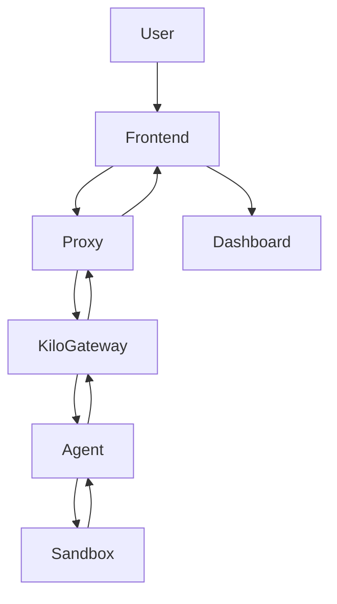

# Vibe Coding Agent System Architecture

## System Overview

The Vibe Coding Agent is designed as a connector/interface for AI-powered coding environments. Its core purpose is to seamlessly link various services—including the Agent, Sandbox, Kilo Gateway, Vercel, and Modal Serverless—with enhanced monitoring and control features. This system enables users to initiate and track coding sessions driven by AI agents, ensuring isolated, secure, and efficient development workflows.

## Architecture Components

### Frontend (Next.js Application)
- Dashboard featuring GitHub-style heatmap for activity visualization, Apple Watch-inspired charts, and line charts for tracking coding sessions and productivity metrics.
- Session management interfaces including lock screens for secure coding sessions.
- Agent activity monitoring with trust-building elements like real-time command auditing and progress indicators.
- UI constructed using shadcn/ui components and Tailwind CSS for a modern, responsive experience.

### Backend Services
- **Proxy Layer**: Facilitates secure connections to the Kilo Gateway API (https://api.kilo.ai/api/gateway).
- **Server**: Handles requests via Next.js API routes, managing routing and middleware.
- **Webhook Handler**: Processes event-driven communications from external services.
- **Workflow Engine**: Employs Upstash for durable execution of complex workflows.
- **Sandbox Worker**: Operates within a Vercel Sandbox environment to provide isolated execution spaces.
- **Session Manager**: Oversees state management across coding sessions.

### External Integrations
- **Kilo Gateway**: OpenAI-compatible API interface for interacting with Large Language Models (LLMs).
- **Vercel AI SDK**: Abstraction layer for various AI providers, enabling flexible model selection.
- **Modal Serverless**: Supports serverless functions and containerized tasks for scalable compute.
- **Agent Client Protocol**: Standardizes communication protocols between the frontend and coding agents.
- **Qwen Code**: Integrates AI-assisted development tools for enhanced coding capabilities.
- **uipro-cli**: Provides UI/UX design skills for AI assistants to generate user interfaces.

## Data Flow

The data flow begins with a user request submitted through the Frontend, routed via the Proxy Layer to the Kilo Gateway. The Gateway processes the query and invokes the appropriate Agent, which executes within the Sandbox environment. Results are collected and relayed back through the Gateway, Proxy, and finally displayed on the Dashboard for user monitoring.

## Security & Trust Features
- Agent monitoring tracks activity, executed commands, and file modifications in real-time.
- Session isolation ensures environments are locked and sandboxed to prevent interference.
- Robust error handling and recovery mechanisms for system resilience.
- Comprehensive audit trails and activity logs for transparency and debugging.

## Scalability Considerations
- Leverages serverless deployment on Vercel for automatic scaling and cost-efficiency.
- Utilizes Upstash workflows for durable, retryable execution of long-running tasks.
- Resource management through sandboxing limits resource consumption and enhances isolation.

## Deployment Strategy
- Frontend and sandbox hosting via Vercel's serverless platform for rapid deployment.
- Additional serverless compute resources via Modal for handling high-volume tasks.
- Automatic scaling and load balancing to accommodate varying user demands.

## JSON Schemas

Relevant JSON schemas define the data structures used throughout the system:

- `schemas/webhook.schema.json`: Defines webhook event formats.
- `schemas/sandbox.schema.json`: Outlines sandbox execution environments.
- `schemas/workflow.schema.json`: Specifies workflow definitions.
- `schemas/dashboard.schema.json`: Structures dashboard response data.
- `schemas/agent-activity.schema.json`: Captures agent monitoring data.
- `schemas/session.schema.json`: Manages session state schemas.
